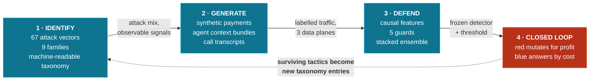
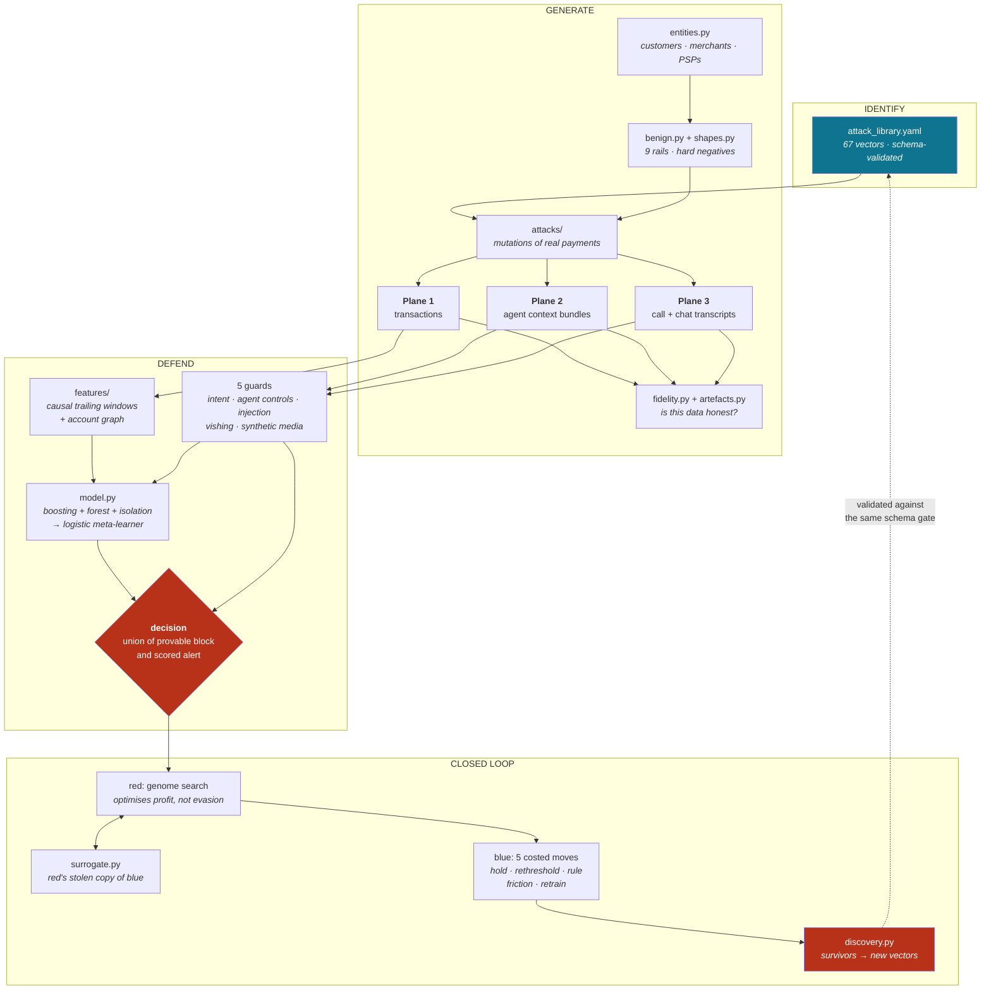
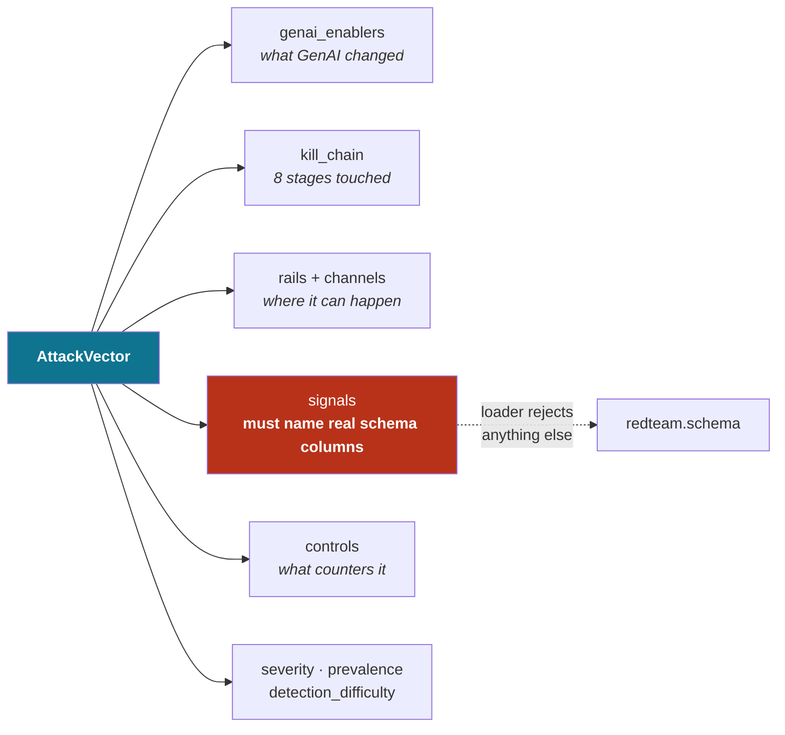
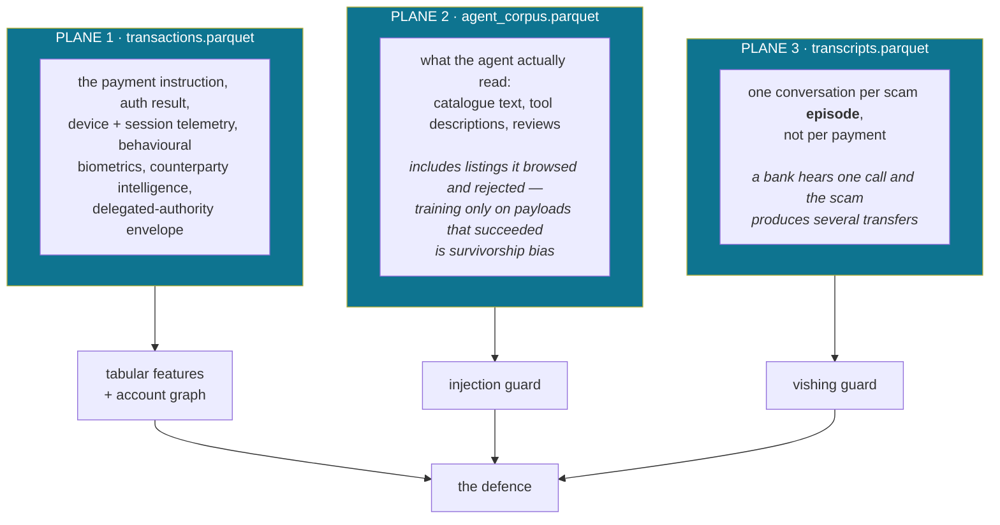
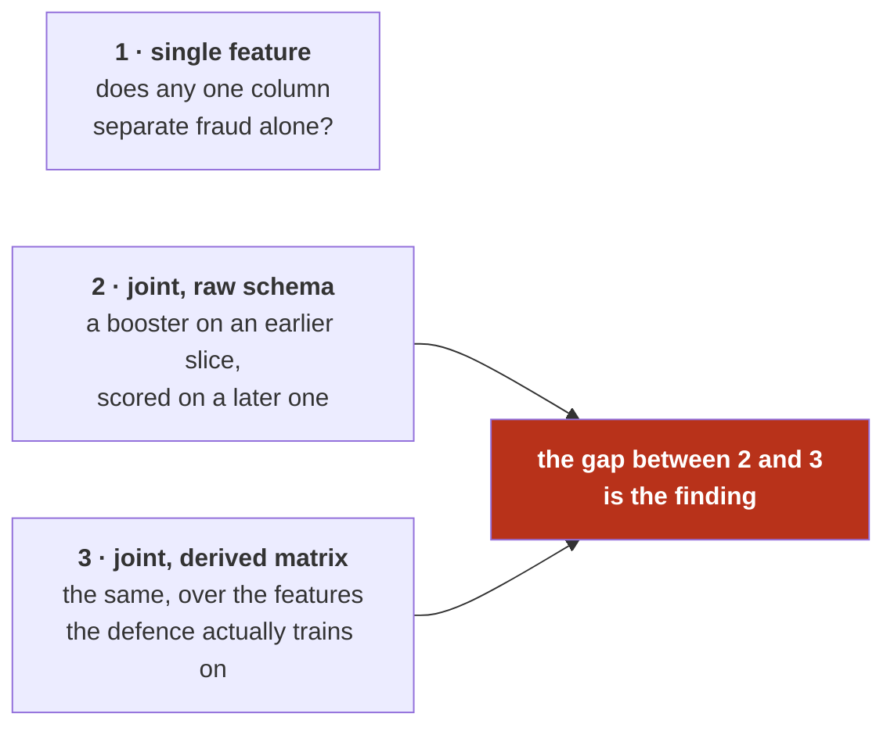
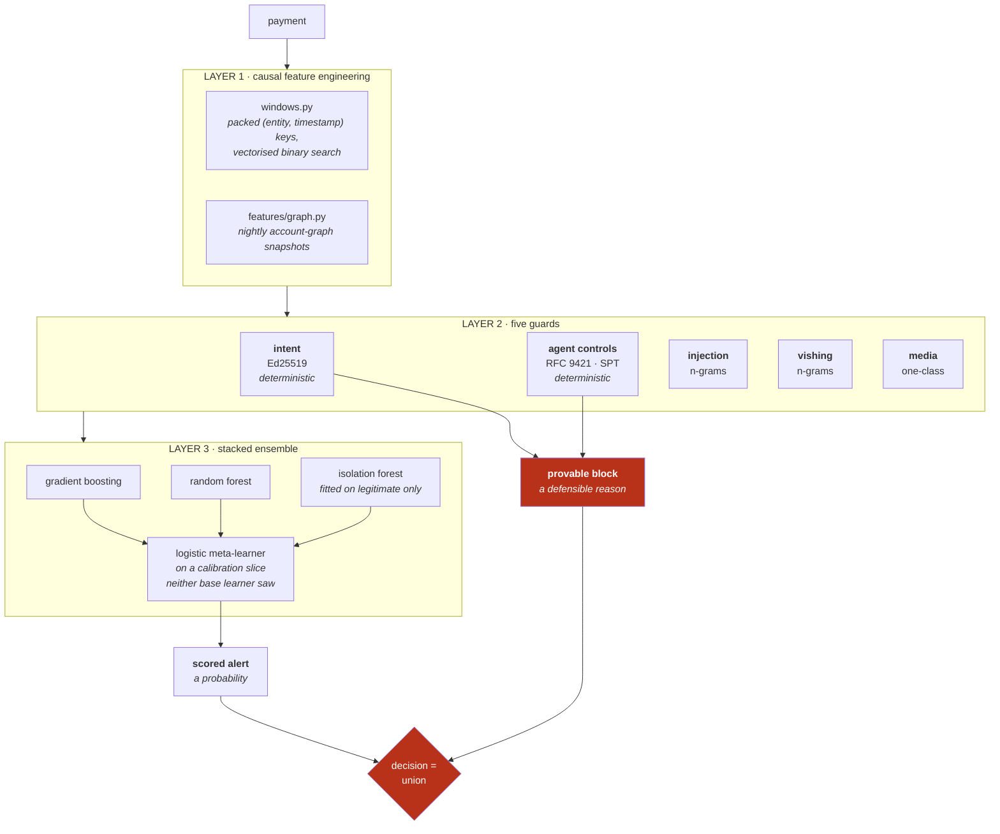
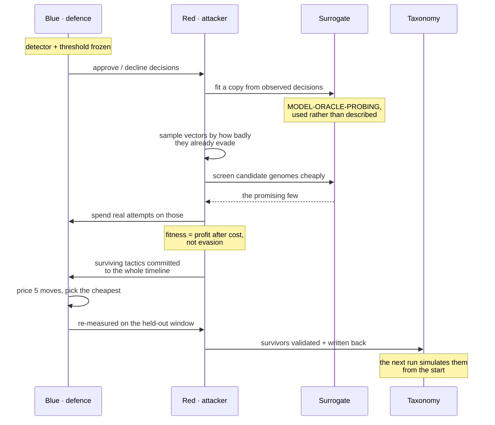
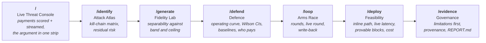

<div align="center">

# Razor

**A closed-loop red-team / blue-team system that discovers how payment fraud is evolving, recreates it as realistic payment traffic, and trains a defence against it — then lets an adaptive attacker hunt for that defence's blind spots so the findings become new attacks.**

<br/>

**[▶ Open the live console](https://Razor.vercel.app)** · no install, no backend, works offline once loaded

<br/>


</div>

---

## The thesis in one diagram

The three pillars are **one loop**, not three deliverables.



Everything below is **produced by running the code**. `artifacts/<run>/REPORT.md` is generated from the run's own CSV tables, so no number in it is hand-written.

> [!IMPORTANT]
> **Which numbers to read.** The figures quoted throughout this file come from the committed `demo` run (`--quick`, seed 7). The full profile is larger, slower, and **reports better numbers than it should**: at that size a learner recovers enough of the generator's own rule set that the 98% headline recall is largely measuring the generator rather than the defence. That is a property of synthetic data, not a bug with a patch — it is measured, reproducible, and written up under [design notes](#design-notes-and-honest-limitations). **The quick-profile figures are the honest ones.**

---

## Contents

| | |
|---|---|
| [Project artifacts](#project-artifacts) | Repository, walkthrough, prototype |
| [Quick start](#quick-start) | Docker, `make`, or raw Python |
| [System architecture](#system-architecture) | How the pieces fit |
| [Pillar 1 — Identify](#pillar-1--identify) | The taxonomy as executable contract |
| [Pillar 2 — Generate](#pillar-2--generate) | Three data planes, and measured fidelity |
| [Pillar 3 — Defend](#pillar-3--defend) | Three layers, and how they are evaluated |
| [The closed loop](#the-closed-loop) | Economically motivated co-evolution |
| [The operator console](#the-operator-console) | The web prototype |
| [The GenAI layer](#the-genai-layer-and-why-it-is-inert-by-default) | Six components, and why the cache ships empty |
| [Serving](#serving) | The deployed model as an HTTP surface |
| [Repository layout](#repository-layout) | Where everything lives |
| [Reproducibility](#reproducibility) | Seed, provenance, byte-identical runs |
| [Design notes and honest limitations](#design-notes-and-honest-limitations) | What these numbers cannot tell you |

---

## Project artifacts

The three core artifacts, and where each one is.

| # | Artifact | Where | Notes |
|:--:|---|---|---|
| **1** | **Code repository** | **[github.com/dhairyahuh/Razor](https://github.com/dhairyahuh/Razor)** | All three pillars plus the loop and the console. Organised, documented, reproducible from a config and a seed. |
| **2** | **Solution walkthrough** | [`docs/Solution-Walkthrough.docx`](docs/Solution-Walkthrough.docx) | Seven sections covering the attacks identified, how they are generated, the detection model with efficacy results, and real-world feasibility. |
| **3** | **Working prototype** | **[Razor.vercel.app](https://Razor.vercel.app)** — nothing to install | Seven-route operator console, deployed as a static site over the committed run. Also runs locally against the live API with `docker compose up` → <http://127.0.0.1:5173>. |

> [!NOTE]
> **The walkthrough is generated, not typed.** [`docs/walkthrough/build.mjs`](docs/walkthrough/build.mjs) parses the run's own CSVs and emits the `.docx`, so no figure in it can drift from the evidence. Rebuild it with:
>
> ```bash
> cd docs/walkthrough && npm install && npm run build
> ```

---

## Quick start

### Deployed Console

**<https://Razor.vercel.app>**

The console over the committed run, as a static site. Every chart, table, drill-down and the
guided tour work, and keep working with the network disconnected once the page has loaded.

The three controls that *compute* — `RUN A ROUND NOW`, the `/deploy` latency probe, and
scoring a payment — need the API and are disabled there. Each says so on screen rather than
showing a pre-recorded result, because a fake result of a button press would be a lie about
what the button does. Run the stack below to make them live.

### Docker — the whole thing, no toolchain

```bash
docker compose up
```

The console on **:5173** and the API on **:8000**, over the committed run. No Python environment, no Node, no internet. See [`frontend/README.md`](frontend/README.md).

### With `make`

```bash
make demo     # venv, install, full quick-profile run, serving bundle, alert queue
make serve    # HTTP API over what that run produced → http://127.0.0.1:8000/docs
make dev      # the same API plus the console, if you have Node 20+
```

### Raw Python

```bash
python3 -m venv .venv && source .venv/bin/activate
pip install -r requirements.txt

# Complete pipeline on a small dataset. Under three minutes on a laptop; start here.
PYTHONPATH=src python -m redteam run --quick

# Full-size run: 5,000 customers over 45 days. Budget 25–30 minutes.
PYTHONPATH=src python -m redteam run
```

<details>
<summary><b>Where the time goes, and how to skip it</b></summary>

<br/>

Most of a run is the **stress tests**, not the model. On the quick profile the four stages cost:

| stage | time | what dominates it |
|---|---:|---|
| identify | 0.1 s | parsing and validating the taxonomy |
| generate | 5.8 s | population, benign traffic, attacks, three data planes |
| **defend** | **147 s** | leave-one-vector-out (one full retrain *per held-out vector*), the ablation grid (four more retrains), the label-shuffle control (one more) |
| loop | 11.5 s | incremental rebuilds keep the co-evolution cheap |

`--shallow --no-loop` skips those and finishes in about twenty seconds if all you want is the headline detection numbers.

</details>

### Individual stages

For iterating on one pillar without redoing the others:

```bash
PYTHONPATH=src python -m redteam identify    # validate and summarise the taxonomy
PYTHONPATH=src python -m redteam generate    # build and persist the dataset
PYTHONPATH=src python -m redteam defend      # train and evaluate against the saved dataset
PYTHONPATH=src python -m redteam loop        # run the co-evolution against the saved dataset
PYTHONPATH=src python -m redteam serve       # HTTP API over the last run's bundle
```

Useful flags: `--config path.yaml`, `--seed N`, `--run-name NAME`, `--shallow`, `--no-loop`, `--refresh-llm`.

Output lands in two places: the generated dataset in `data/<run_name>/`, and every table plus the narrative report in `artifacts/<run_name>/`.

### Tests

```bash
python -m pytest                 # 283 test functions across 12 modules, about 4 minutes
python -m pytest -m "not slow"   # skip the end-to-end CLI test
```

---

## System architecture



---

## Pillar 1 — Identify

[`src/redteam/identify/attack_library.yaml`](src/redteam/identify/attack_library.yaml) is a machine-readable taxonomy of **67 attack vectors** across nine families.

> It is treated as **code**, not documentation. It is parsed into typed objects, validated against the transaction schema, and it drives the attack mix — so the taxonomy and the simulator cannot drift apart.

### The nine families

| family | count | what it covers |
|---|:--:|---|
| **`APP`** | 15 | **Authorised push payment.** The victim authenticates correctly and pushes the money themselves. Voice-cloned executives, deepfake video calls, pig butchering, safe-account screenshare, Gen Alpha in-game extraction. |
| **`ATO`** | 7 | **Account takeover and authentication subversion.** IVR voice-print bypass, SIM swap, synthetic behavioural-biometric trajectories, session hijack from trusted hardware. |
| **`ID`** | 7 | **Identity fabrication.** GAN document forgery, virtual camera injection, rPPG liveness spoofing, synthetic-identity credit bust-out. |
| **`CARD`** | 7 | **Card, merchant and dispute abuse.** BIN enumeration at machine speed, deepfake complaint and return fraud, counterfeit storefronts. |
| **`AGENTIC`** | 10 | **Delegated authority.** Indirect prompt injection, MCP tool poisoning, confused deputy, shared-payment-token replay, crawler impersonation, agent-optimised counterfeit storefronts. |
| **`RAIL`** | 7 | **Rail and messaging infrastructure.** ISO 20022 field poisoning, collect-request abuse, cross-border corridor arbitrage, instant-rail velocity exploitation. |
| **`MULE`** | 5 | **The receiving side.** Ring provisioning, layering and fan-out, recruited and rented accounts, cash-out. |
| **`MODEL`** | 5 | **The defence as an asset with its own attack surface.** Adversarial tabular perturbation, decision-boundary oracle probing. |
| **`CRYPTO`** | 4 | **Digital-asset rails.** LLM-accelerated contract vulnerability discovery, flash-loan exploitation. *Documented, not simulated* — the schema is a fiat payment schema and pretending otherwise would be a fiction. |

### What each vector declares



**The loader rejects any signal that is not a real schema column**, so a vector cannot claim evidence the pipeline is incapable of producing. **53 of the 67** are wired to a generator and appear in the data; the rest are documented with the reason they are not simulated.

The kill chain has eight stages: `reconnaissance → resource_development → contact → pretext → authorisation → settlement → layering → cash_out`.

The agentic family is grounded in the **actual protocol landscape** rather than a generic notion of "AI agents". [`docs/AGENTIC_PROTOCOLS.md`](docs/AGENTIC_PROTOCOLS.md) maps each agentic vector onto **AP2 mandates, x402, Web Bot Auth** and the shared-payment-token flows, and states which of them the guards in this repository actually implement.

---

## Pillar 2 — Generate

[`src/redteam/generate/`](src/redteam/generate/) builds a synthetic but **structurally honest** payment ecosystem.

### Population and benign traffic

Customers with age bands, digital literacy, tenure, balances, home locations, device histories and agent-adoption rates; merchants with MCCs and domain ages; PSPs with differing mule-control maturity. Legitimate traffic is simulated across **nine rails** with realistic diurnal and weekly shape, lognormal amounts, payee reuse with occasional exploration, and salary-window effects.

<details>
<summary><b>Why the population deliberately includes a recently-onboarded cohort</b></summary>

<br/>

Roughly a seventh of customers and a fifth of merchants are recently onboarded — because an ecosystem where every legitimate beneficiary is well established turns *"the payee's account is young"* into a fraud rule with no false positives. Real ecosystems onboard continuously and those accounts get paid from day one.

For the same reason **every channel an attack can use carries genuine legitimate volume**: phone banking appears in the benign stream at a rate that rises as digital literacy falls, so a vishing-driven IVR payment is *correlated* with fraud rather than decisive.

</details>

### Hard negatives — the false positives that actually cost a bank a customer

A configurable share of legitimate payments are **engineered to look alarming**: a first large transfer to a new payee, at night, on a new device. About a third stack two or three archetypes at once, because a costume on a single axis lets a model win by counting red flags.

> The customer who lands abroad, reinstalls the app on a replacement phone, calls support and then sends a large sum to a payee added ten minutes ago is **one person**, and every one of those facts is true simultaneously.

### Attacks as mutations, not synthesis

Each generator starts from a **real benign payment** belonging to a plausibly selected victim and overwrites only the fields the attack actually touches. The victim's typing rhythm, device history, home city and spending scale stay internally consistent — which is what a from-scratch fraudulent row never manages.

**Signals fire probabilistically.** A generator that always sets `screen_share_active = 1` for the safe-account scam creates a single-feature giveaway and a meaningless 0.999 AUC. `attacks.signal_emission` controls how reliably each tell actually fires.

**Shared criminal infrastructure.** One mule registry is shared across every proceeds-taking family, so an APP scam, a purchase scam and a QR-tampering campaign can deposit into the same first-hop mule that then fans out. Mule capacity includes **recruited accounts** — real customer accounts with real tenure and real prior volume — because if every receiving account were freshly minted, *"payee has no history"* would separate fraud almost perfectly and the whole problem would collapse into one feature.

**Purpose-opened collection accounts are seasoned** before they are used: a handful of small, unremarkable credits from unrelated parties, spread over the fortnight before the first scam payment lands. This is real tradecraft, and it exists for exactly the reason it is modelled here — novelty and velocity rules are what rings are working around. It forces the defence to reason about a *change* in an account's inbound pattern rather than about the absence of any pattern at all.

<details>
<summary><b>Four more constraints that stop the generator leaking the label</b></summary>

<br/>

**Attacks stay inside the rail's physics.** When a vector forces a payment onto a rail it actually uses, the channel is redrawn to match, because rail and channel are not independent: UPI person-to-person does not happen at a card terminal. Vectors whose channel *is* the attack, like an agent settling over an API, set it explicitly. Without this, attacks invent rail/channel pairs that legitimate traffic never produces, and the defence collects recall it has not earned.

**Attacks live on the same calendar as everything else.** `redteam.generate.timing` is the one place that decides when a payment happens, and both the benign path and the attack generators draw from it. When bespoke generators placed episodes with a flat draw instead, fraud was spread evenly across a week that real traffic is not spread evenly across, and day-of-week separated the two for free. Attackers *do* prefer the small hours, so a night bias is applied **on top of** the ordinary diurnal curve rather than replacing it — which keeps "2am" the weak evidence it actually is.

**Attacker infrastructure shares the customer namespace.** Purpose-opened mules, synthetic identities and counterfeit storefronts are numbered above the real population rather than into prefixes of their own. A dedicated prefix makes an account's role readable from its id, and every entity-keyed feature and graph node inherits that separation. Attacker device ids come from a monotonic run-wide counter for the same reason: per-frame numbering restarted at zero, so unrelated takeovers shared a handset and the device features saw a phantom farm spanning the whole dataset.

**Multi-currency amounts are converted, not relabelled.** Every generator draws on the INR scale the population is built on, so rails that settle in dollars or euros are converted at a fixed rate table and carry both the settled figure and a base-currency equivalent. Stamping `USD` on an unconverted amount had put the median FedNow payment near $9,800 with a tail in the millions; velocity windows and graph edge weights all sum the base amount, because adding a euro-settled payment to an INR window understates it a hundredfold and hides the cross-border structuring those windows exist to catch.

</details>

### Three data planes, not one

The GenAI-era attacks this project is about **do not leave their evidence in a payment message**.



**Agent context bundles** ([`generate/agentic_corpus.py`](src/redteam/generate/agentic_corpus.py)). Injected payloads are composed from framings, actions, concealments and lexical jitter, then obfuscated (zero-width joiners, HTML comments, review embedding, reversed base64-ish wrappers), and a share are deliberately **subtle** — phrased like ordinary commercial guidance.

**Call and chat transcripts** ([`generate/transcripts.py`](src/redteam/generate/transcripts.py)). Both classes are drawn from the same pool: payments where somebody was on the telephone to the bank. That coverage rule is load-bearing and is discussed under [the guard-leakage audit](#are-the-guard-outputs-features-or-are-they-the-label) — getting it wrong turned *"a transcript exists"* into the label and pushed headline recall to 100%.

**Evasion as a modifier, not a category.** A configurable share of *all* fraud receives gradient-free evasion tuning. Only attacker-controllable levers move: amount, hour, session pacing, beneficiary naming and registration lead time, and which coercion tells to leave behind. The attacker cannot mutate the victim's account tenure, and letting them would make the exercise a fiction.

### Fidelity is measured, not asserted

[`redteam.generate.fidelity`](src/redteam/generate/fidelity.py) scores Benford adherence, round-number mass, diurnal and weekly shape, amount tails, per-customer consistency, payee-graph shape, fraud/legitimate overlap, and **three separability checks**.



The statistic reported is **recall at a 0.5% false-positive budget** rather than AUC, because under real class imbalance AUC flatters everything and hides the part that decides whether a system is deployable.

> **Deployed card-fraud systems land around 0.5–0.85 there. Above 0.92 the scorer flags its own data as measuring the generator rather than a defence.**

The third check exists because the second was auditing the wrong matrix. A feature built from a leaky entity id can separate fraud perfectly while every raw column looks innocent. **A large gap means the feature engineering, not the schema, is where the generator leaks.**

<details>
<summary><b>The check had stopped being able to fail — twice, in opposite directions</b></summary>

<br/>

**First failure: early stopping.** scikit-learn enables early stopping above 10,000 rows and validates on a random slice, which at a sub-1% fraud rate holds almost no fraud — so the loss looked flat, boosting halted after about fifteen iterations, and the probe reported a comfortable number produced by a model that never finished training. It under-reported separability precisely when there was a lot of it. With early stopping disabled the raw matrix scored 0.67 and the derived matrix 0.92, and the flag fired. That gap is what the rest of the generator work went into closing.

**Second failure: variance.** Turning early stopping off created the opposite problem, which took a full-size run to expose. An unbounded 150-round depth-6 fit against a 0.7% positive rate overfits by an amount that depends on the exact training rows, so the probe's answer swung **nineteen points** across resamples of identical data — wider than the ceiling it enforces. It now reports the **median of five bootstrap refits** from a shallower, slower booster (depth 4, learning rate 0.05) and publishes `refit_spread` alongside: 1.8 points on the full profile, under 7 on the demo run. Both are stated in the report, because a probe that cannot reproduce its own answer is not evidence of anything.

</details>

**On the demo run** the raw matrix recovers **71.8%** of fraud at a 0.5% budget and the derived matrix **80.6%** — both inside the 0.5–0.85 band deployed systems occupy, with the derived layer adding a real but bounded 8.8 points rather than the 25 it once did.

### The artefact hunter

[`redteam.generate.artefacts`](src/redteam/generate/artefacts.py) searches **every column** for a categorical value, id prefix or narrow numeric band that fraud carries and legitimate traffic (almost) never does.

It found five fraud-only namespaces on first run — mule operators under a `MULEOP-` customer prefix, counterfeit storefronts under an `MX` merchant prefix, colliding attacker device ids, mule outbound accounts, and voice-print authentication that only ever appeared under attack. **Each was fraud with probability 1 before a single behavioural feature was computed.** Finding them by reading code does not scale, so the search runs as a test.

---

## Pillar 3 — Defend

Three layers, deliberately **not merged**, because they fail differently and a fraud operations team responds to them differently.



> A payment declined for `PAYEE_MISMATCH` has a reason an investigator can defend. One declined for a score of 0.94 does not. **That is why the layers stay separate.**

### Layer 1 — causal feature engineering

Velocity, counterparty, behavioural and account-graph features, **all computed over trailing windows that exclude the row being scored**. [`src/redteam/windows.py`](src/redteam/windows.py) implements this with packed `(entity, timestamp)` keys and vectorised binary search; the tests compare every routine against a brute-force reference, because a window that accidentally includes the current row leaks the label for every burst-shaped attack and produces an offline AUC that evaporates in production.

### Layer 2 — five guards, of which two are deterministic and three read content

| guard | mechanism | what it can and cannot claim |
|---|---|---|
| **Intent** [`intent_guard.py`](src/redteam/defend/intent_guard.py) | **Ed25519** signatures over intent artefacts — verifying signature, expiry, replay, payee binding, currency, amount tolerance and scope | Asymmetric rather than HMAC because the property a dispute needs is **non-repudiation**, and a shared secret gives the verifier the power to forge what it verifies. A **decline** requires a presented artefact to contradict the settlement request — provable, defensible, and **no false positives on legitimate traffic by construction**. A **missing** artefact only raises friction, because it describes an attacker but also describes every agent integration predating the protocol. |
| **Agent identity** [`agent_controls.py`](src/redteam/defend/agent_controls.py) | Web Bot Auth-shaped registry, **RFC 9421** HTTP message signatures, scoped tokens with proof-of-possession binding and spend ceilings | The ceiling is reported as a **loss bound, not a block**: it does not stop a compromised agent, it caps what the compromise is worth. Reporting it as a catch rate would be a category error. |
| **Injection** [`injection_guard.py`](src/redteam/defend/injection_guard.py) | Word plus character n-grams over normalised bundle text, calibrated | Its in-distribution score is near-perfect and **the report says outright this should not be believed** — payloads are templated, so a bag-of-n-grams model can memorise them. The numbers to read are recall on **phrasings held out of training** and on an **entire payload family withheld**. |
| **Vishing** [`vishing_guard.py`](src/redteam/defend/vishing_guard.py) | The same shape, over call and chat transcripts | Every evaluation returns near 1.0 *including the ones built to break it*, and the module says plainly why: **one author wrote both classes**, so the boundary is perfectly consistent by construction. Three corpus artefacts that would have produced the same score for worse reasons were found and removed; fixing them moved the number by nothing, which is itself the finding. |
| **Synthetic media** [`deepfake_guard.py`](src/redteam/defend/deepfake_guard.py) | One-class novelty detector fitted on genuine biometric captures only | **Not a deepfake detector**, and the report says so. It scores the consistency of vendor telemetry (voice match, liveness, biometric match, OCR confidence) and reports its **capture coverage**, because a headline averaged over payments carrying no biometric at all would be diluted nonsense. |

**Zero-shot injection recall on the demo run** — an entire payload family withheld from training:

| held-out family | rows | zero-shot recall |
|---|---:|---:|
| `confused_deputy` | 327 | **82.6%** |
| `tool_poisoning` | 340 | 65.0% |
| `payee_swap` | 330 | 63.3% |
| `cart_stuffing` | 388 | 58.0% |

### Layer 3 — the stacked ensemble

[`defend/model.py`](src/redteam/defend/model.py): gradient-boosted trees, a random forest, and an **isolation forest fitted on legitimate traffic only**, combined by a logistic meta-learner fitted on a calibration slice neither base learner saw. The unsupervised channel is what keeps scoring a vector nobody has labelled yet.

### How it is evaluated

| principle | why |
|---|---|
| **Temporal splits, never random** | Fraud is campaign-structured; a random split puts half a mule ring in training and half in test, and the resulting AUC measures nothing. |
| **A false-positive budget, not an F1 optimum** | An alert queue is a fixed resource. *"Maximise F1"* is not an instruction a fraud-ops team can act on. |
| **Value-weighted recall** | Catching ten ₹500 card tests is not catching one ₹4m invoice redirect. |
| **Per-vector and per-family recall, worst first** | The average hides the holes. |
| **False positives split by segment** | Hard negatives reported separately, because that is where customer harm actually lands. |
| **Evasion delta** | Recall on adversarially tuned fraud against the untuned version of the same vectors. |
| **Leave-one-vector-out retraining** | The closest offline proxy for a genuinely novel attack. Anything still caught is caught by generalisable structure rather than memorisation. |

### Headline — demo run (`--quick`, seed 7)

<div align="center">

| metric | value | 95% CI |
|---|---:|---:|
| **recall** @ 0.535% FPR | **71.6%** | 61.8 – 80.4 |
| precision | 57.9% | — |
| value-weighted recall | 79.9% | — |
| PR AUC | 0.757 | 0.685 – 0.829 |
| **partial AUC** (0–2% FPR) | **0.877** | 0.838 – 0.914 |
| ROC AUC | 0.980 | 0.966 – 0.991 |

*1,000-resample stratified bootstrap, threshold re-derived inside each resample.*

</div>

Per-family recall spans **38.5%** (card fraud, 13 rows) to **100%** (agentic compromise, 11 rows). The worst slice is payments to payees aged three months to two years at **58.8%** on 34 rows.

### Against simpler detectors — the same rows, the same budget

| model | features | recall | precision | note |
|---|---:|---:|---:|---|
| **ensemble (deployed)** | 172 | **71.6%** | 59.8% | stacked boosting + forest + isolation |
| logistic regression | 172 | 51.0% | 51.5% | linear, same feature matrix, balanced classes |
| expert rules | 10 | 0.0% | 0.0% | 10 hand-written conditions, unweighted count |
| `payee_is_first_time` | 1 | 0.0% | 0.0% | one column, no fitting |

> On the quick profile, ten hand-written rules and the single most-cited fraud heuristic both catch **nothing at all** at a 0.5% budget. On the full profile the same table reads 98.5% for the ensemble against **2.8%** for the expert rules.

### Making the numbers falsifiable

Six additions, all of which exist because *a detection result on synthetic data is worth nothing unless the ways it could be wrong are measured rather than promised.*

<details>
<summary><b>1 · Intervals on everything, and thin cells marked as such</b></summary>

<br/>

A per-vector recall computed on three rows can only be 0, ⅓, ⅔ or 1; printing `1.0000` beside it is arithmetic pretending to be evidence. Every rate carries a **95% Wilson interval** — Wilson rather than the normal approximation, which on proportions near 0 or 1 at these sample sizes cheerfully returns bounds outside [0, 1] and collapses to zero width on 3-of-3.

Cells with fewer than 20 examples carry `n_sufficient = 0`. They stay **visible** instead of being deleted, because a vector with four test-window rows is a fact about the generator's mix worth seeing.

</details>

<details>
<summary><b>2 · Partial AUC replaces ROC AUC as the headline</b></summary>

<br/>

The fidelity module argues at length that AUC flatters everything at this imbalance, so leading the defence section with 0.98 would be incoherent. The full curve integrates over false-positive rates up to 100%, meaning most of its area comes from operating points that would alert on one payment in three.

**Partial AUC over the usable 0–2% region, McClish-corrected so chance still reads 0.5**, is reported instead. On the demo run ROC AUC is 0.980 and partial AUC 0.877.

</details>

<details open>
<summary><b>3 · An ablation grid over feature layers</b></summary>

<br/>

The obvious objection to any strong number on generated data is that the generator leaks through the features, and the only honest answer is to **remove them and publish the result**. Four cumulative rows, each retraining the full ensemble:

| layer | features | recall | delta |
|---|---:|---:|---:|
| raw schema | 86 | 0.569 | — |
| + trailing-window | 150 | 0.628 | **+0.059** |
| + account graph | 161 | 0.706 | **+0.078** |
| + guards | 172 | 0.618 | **−0.088** |

**The last row is negative and is published as it came out.** Eleven guard columns, most of them near-constant on a test window holding about a hundred fraud rows, cost the ensemble more in variance than they return in signal. The guards still earn their place — they contribute to the *decision* through the deterministic block, which the ablation grid does not model, and they catch specific vectors the tabular model is blind to — but as tabular features at this sample size they are a net loss, and **a grid that only ever showed layers helping would not be worth running.**

</details>

<details>
<summary><b>4 · A label-shuffle null control</b></summary>

<br/>

The same pipeline refit on permuted labels. This is the one check that **cannot be argued with**: if feature construction, the temporal split or threshold calibration ever begins to condition on the label, this beats chance regardless of the mechanism and regardless of whether anyone thought to look for it.

On the demo run it reports recall **0.0196** against a 0.005 budget and ROC AUC **0.5007**. It runs as a test, so a future leak fails CI rather than being discovered by a reader.

</details>

<details>
<summary><b>5 · Automated worst-slice mining</b></summary>

<br/>

Per-vector recall answers which *attack* gets through. This searches every rail, channel, amount band and payee-age band — and every **pair** of them — for the worst recall on at least 25 examples.

It answers which *kind of payment* gets through whatever produced it, which matters because an attacker who finds a soft slice does not need a new vector, only a reason to route existing fraud through it. **Automated weak-spot discovery is a red-team capability**, so it belongs in the loop's evidence rather than in a reader's head.

</details>

<a name="are-the-guard-outputs-features-or-are-they-the-label"></a>
<details>
<summary><b>6 · A guard-leakage audit, added after the absence of one cost a headline</b> ← read this one</summary>

<br/>

The three fidelity separability probes deliberately zero-fill the guard columns, because guards are defence outputs computed long after generation. That is correct, and it also means those probes are **structurally incapable** of seeing a guard that has become a label. One did.

The transcript plane originally emitted a scam conversation for every eligible fraud campaign and then sized the legitimate corpus as a multiple of the scam count. A payment carrying a transcript was therefore **95% likely to be fraudulent before a single word was read**.

Worse: `score_transactions` spread each transcript's score across its `campaign_id`, and `campaign_id` defaults to the empty string — so all thirty-five thousand legitimate payments were pooled into one "episode" and handed the highest-scoring genuine transcript in the run, while fraud rows in episodes with no captured call kept 0.0. **`vishing_score == 0` became a near-perfect *inverted* label.**

Headline recall read **100%**, with fifty-three of fifty-three vectors at 1.000. The only table in the entire report that showed anything wrong was the ablation grid's guard row.

Both defects are fixed. Headline recall moved from **100% → 71.6%**.

`defend_guard_leakage.csv` now audits every guard column as a standalone classifier and reports **`presence_lift`** — how much more likely a payment is to be fraudulent purely because the column is populated at all. A content guard above AUC 0.95 or above 0.75 `p_fraud_given_present` **fails a test**. The deterministic controls are exempt, and the exemption is principled: an intent block requires a presented artefact to contradict the settlement request, which legitimate traffic cannot do.

The fix holds at scale — worth stating, because the original defect only became visible at scale. On the 281,906-payment full profile the worst content guard is the vishing score at AUC 0.605 with a presence lift of 12×, and the guard layer contributes 2.3 recall points to the ablation grid rather than the 29 it was contributing when broken.

**The guard rails are themselves tested rather than trusted:** a canary plants an obvious leak — a column that is the label plus noise — and asserts both the single-feature and joint probes fire on it. A probe that had silently stopped working would otherwise report a clean bill of health on trivially separable data.

</details>

---

## The closed loop

[`src/redteam/loop/`](src/redteam/loop/). This is the route that carries the submission's actual claim.



### A genome has cosmetic genes and structural ones

| | levers |
|---|---|
| **Cosmetic** | amount, hour, session pacing, beneficiary naming, which coercion tells to leave behind |
| **Structural** | rail, victim cohort, how the payment is structured into instalments, spacing between them, mule count and reuse, PSP concentration, how deeply receiving accounts were seasoned |

The structural genes are the ones that matter: they change **which rows exist, between whom, and when**, so they reach the counterparty-novelty and velocity features the defence leans on hardest. They are all real purchasable capabilities, which is the standard the whole search space is held to.

### Red optimises profit, not evasion

[`loop/economics.py`](src/redteam/loop/economics.py) prices the attacker's side:

| item | cost |
|---|---:|
| tooling subscription | ₹1,500 |
| fresh mule account | ₹600 |
| aged mule account | ₹3,500 |
| named mule account | ₹1,200 |
| payee pre-registration | ₹40 |
| each seasoning payment | ₹120 |
| residential proxy | ₹25 |
| operator time | ₹15 / min |

> A genome that evades perfectly and costs more than it extracts is **not a good attack**, and a search that scored evasion alone would keep finding them. Round ROI is reported alongside recall.

### Blue has five moves, not one

[`loop/blue.py`](src/redteam/loop/blue.py) and [`loop/strategy.py`](src/redteam/loop/strategy.py): **absorb the losses, move the threshold, add a deterministic rule, add step-up friction, or retrain.** Each is costed — fraud losses, alert review, false declines, customer friction, model change control — and blue picks the cheapest.

**Demo run, round 1** — every option priced, on the same held-out window:

| move | recall | FPR | total cost | chosen |
|---|---:|---:|---:|:--:|
| **add_rule** | 0.783 | 0.646% | **₹333,381** | ✅ |
| rethreshold | 0.745 | 0.909% | ₹663,664 | |
| hold | 0.689 | 0.535% | ₹821,911 | |
| add_friction | 0.755 | 0.535% | ₹832,699 | |
| retrain | 0.783 | 0.495% | **₹3,160,118** | |

Blue added a rule. **Retraining reached exactly the same recall (0.783) and cost nearly ten times as much** — because the ₹75,000 model-change cost is dwarfed by the fraud losses the retrained model incurred: it caught the same *proportion* of fraud but missed higher-*value* fraud, which is precisely why value-weighted recall is reported separately. In round 2, blue re-thresholded (₹653,225) rather than retrain (₹3,033,195).

> **A loop where blue always retrains is a loop that has never had to justify the change to a model risk committee.**

### What comes out

**Surviving tactics feed back into the taxonomy.** [`loop/discovery.py`](src/redteam/loop/discovery.py) formalises each one as a new `AttackVector`, validates it against the same schema gate as the hand-written library, and writes it to `discovered_vectors.yaml`. **Four were accepted on the demo run and none were rejected.**

**Control gaps** — which library control each surviving tactic defeated, and how often:

| control | defeated | tested | defeated by |
|---|---:|---:|---|
| `second_order_behavioural_stats` | **4** | 4 | `form_fill_duration_s` |
| `device_attestation` | 0 | 4 | *held* |
| `injected_challenge_perturbation` | 0 | 4 | *held* |

**Durability is measured with a transfer matrix.** Each round's surviving tactics are scored against every detector trained in every later round. An attack that stops working the moment blue retrains is a different thing from one that keeps working, and an average over rounds hides which you have.

**Red builds a surrogate of the detector.** [`loop/surrogate.py`](src/redteam/loop/surrogate.py) fits a lightweight copy of blue's model from the approve/decline decisions red has already observed, and pre-screens candidate genomes against it. Surrogate agreement with the real detector is reported per round — **0.971 and 0.973** on the demo run — because a surrogate that had stopped tracking would silently turn the search back into a random one.

**Rebuilds are incremental.** [`loop/incremental.py`](src/redteam/loop/incremental.py) recomputes features only for the rows and entities a mutation touched, which is what makes a multi-round search finish in eleven seconds rather than minutes.

### Honesty in the reporting

Fitness is measured over a vector's **whole timeline**, because an attacker running a campaign observes all of their own traffic rather than a held-out slice. The *reported* effect of a round is measured on the **held-out window**, so a vector is only eligible as a target if it appears in both — without that, a round can target a campaign with no test-window rows and report its before-and-after recall on an empty set.

Results are reported as recall lost to red and recovered by blue, **separately for the targeted vectors and for all fraud**, because an attacker who comprehensively breaks one vector barely moves an average taken over thirty. Rounds where red *loses* ground are reported as such. With a few dozen fraud rows per targeted vector, a single transaction is worth two or three percentage points, and **a search that reports only its wins is a search that is fitting noise.**

The full profile runs twelve rounds and reports a convergence verdict of **`diverging`** — red gained faster than blue recovered — and the console says so rather than rounding it up into a success.

---

## The operator console

A fraud-operations console, not a dashboard. [`frontend/`](frontend/) — Vite, React, TypeScript. See [`frontend/README.md`](frontend/README.md).



### The two modes

| mode | behaviour |
|---|---|
| **Live** | A backend is reachable. Every number is read from the run's artefacts through the API, and the interactive controls — scoring, `RUN A ROUND NOW`, the latency probe — execute against the deployed model. |
| **Demo** | No backend. Every read resolves against static JSON baked from the committed run. Every chart, drill-down and table works. **The controls that *compute* are disabled and say why**, because a pre-recorded result of a button press would be a lie about what the button does. |

The demo payload is **generated by calling the same endpoints it replaces**. It is a recording, not a fixture: nothing in it is hand-written.

### The rules it was built to

1. **No fabricated numbers.** Every figure traces to an artefact the pipeline wrote. No mock data, no placeholder, no `Math.random()`.
2. **Backend metric names, verbatim.** `recall_lost_to_red`, `zero_shot_recall`, `value_recall`, `n_sufficient` — not prettified, because judges cross-check against the CSVs and a renamed column is not greppable.
3. **Every panel names its source, and the name is a link.** Checking a number costs one click.
4. **Missing is not zero.** A metric the run could not compute renders as an em dash.
5. **Every panel is error-boundaried.** Delete any CSV and that one panel says which file it wanted; every other panel still renders.
6. **No external requests at runtime.** Fonts self-hosted. It renders with the network cable pulled.

---

## The GenAI layer, and why it is inert by default

[`src/redteam/genai/`](src/redteam/genai/) holds six components that call a language model:

| module | what it does | fallback when the cache is empty |
|---|---|---|
| `ideate.py` | proposes new attack vectors in the library's own schema | the hand-written taxonomy, unchanged |
| `payloads.py` | writes prompt-injection payloads | composed from framings, actions, concealments, jitter |
| `transcript_bank.py` | writes call and chat transcripts in a second voice | template-composed scripts — one author for both classes |
| `agents.py` | red and blue agents reasoning inside the loop | the genome search and blue's costed move selection |
| `judge.py` | LLM-as-judge scoring generated rows against described real ones | not scored; the fidelity composite omits it |
| `narrate.py` | turns reason codes into analyst-readable summaries | the reason codes themselves |

All of them read through [`genai/cache.py`](src/redteam/genai/cache.py), a **content-addressed cache** keyed on the prompt, model, temperature and task, storing the prompt beside the answer so the cache can be audited. With a populated cache a run is **byte-identical offline, forever, with no API key** — the key is a build-time dependency, like a lockfile.

> [!NOTE]
> **The committed cache is empty**, and every component therefore falls back to its template-composed path and says so in the run log and in the report. Populating it requires an API key; the alternative — hand-writing completions and committing them as a model's output — would make every claim built on top of them **false**. Run with `--refresh-llm` and `$REDTEAM_LLM_API_KEY` set to fill it. See [`cache/llm/README.md`](cache/llm/README.md).

**Nothing in the detection metrics changes either way.** What changes is how much of the *text* in the system was written by a model rather than by a template — which matters most for the vishing guard, whose near-perfect score is a single-author artefact that only a second author can settle.

**The GenAI in the threat model is what the attacks represent, not a runtime dependency of the simulator.** Voice cloning, deepfake video, LLM-written pretexts and indirect prompt injection are the *modelled capability* — 93 distinct GenAI enablers across the taxonomy. Simulating a voice-cloned call does not require cloning a voice; it requires modelling what such a call leaves behind in a payment stream.

---

## Serving

[`src/redteam/serve/`](src/redteam/serve/) turns the last run into something a reviewer can **operate** rather than read about.

```bash
make demo && make serve      # then open http://127.0.0.1:8000/docs
```

The defend stage publishes two things automatically: a **serving bundle** (`artifacts/serving/bundle.pkl`) holding the detector, its guards, its threshold, its column order and the run's provenance stamp in **one atomic file**; and the scored test set in **SQLite**, because an alert queue is a paging and filtering workload.

> The bundle is one object rather than a directory of pickles for a specific reason: a threshold calibrated on one window, a guard fitted on another, and a column order from a third **will** drift apart if saved separately — and the resulting failure is silent.

| endpoint | what it does |
|---|---|
| `POST /score` | Score one payment. Separates the model alert from each deterministic guard block, and reports **`feature_completeness`** because a caller who supplies a raw payment message has a complete *message* and an almost empty *matrix*. |
| `POST /score/batch` | Up to 500 at once. |
| `POST /attack` | Mutate one attack vector with chosen evasion levers and re-score it against the deployed model, reporting recall before and after **on the same rows**. |
| `POST /simulate` | Launch a pipeline run in the background; progress streams from `GET /jobs/{id}/events` as server-sent events. |
| `GET /runs/{id}/alerts` | One page of the alert queue, highest score first, joined to case dispositions. |
| `PUT /runs/{id}/cases/{txn}` | Disposition an alert. |
| `GET /model-card` | Generated live from the deployed bundle, so it cannot describe a different model than the one answering requests. |
| `GET /health` | Reports **the run id being served**, not just "ok" — a green check on a service quietly running last week's model is worse than a red one. |

Three deliberate choices:

- An unknown feature key is a **422 rather than a silent default**, because a caller who misspells `payee_account_age_days` and gets a 200 has been told their feature was used.
- Scoring is **rate limited**, because an unauthenticated scoring endpoint with no limit is a free oracle for mapping the decision boundary — a threat this repository ships an attack for.
- **Nothing trains.** No request can change what another request gets back.

Containers publish on **loopback only**, run as a **non-root** user, with BLAS thread fan-out pinned to one so it does not fight the ensemble's own parallelism inside a CPU quota.

---

## Repository layout

```
configs/                    default.yaml (full run) and quick.yaml (fast smoke run)
cache/llm/                  content-addressed LLM completions (ships empty; see its README)
docs/AGENTIC_PROTOCOLS.md   AP2, x402, Web Bot Auth and SPT mapped onto the agentic vectors
src/redteam/
  config.py                 one dataclass tree; a YAML file plus a seed fully determines a run
  schema.py                 the canonical transaction schema: the red/blue contract
  windows.py                causal trailing-window aggregates
  provenance.py             run id, git sha, config and library hashes stamped on every artefact
  identify/                 attack taxonomy, loader, validator
  generate/
    entities.py             customers, merchants, devices, PSPs
    benign.py               legitimate multi-rail traffic and hard negatives
    shapes.py               legitimate traffic shaped like the fraud the defence hunts
    attacks/                one module per family, plus shared mutation machinery
    agentic_corpus.py       the agent's context window as a second data plane
    transcripts.py          call and chat conversations as a third
    enrich.py               counterparty intelligence, computed causally
    campaign.py             orchestration: mix, budget, evasion, merge
    fidelity.py             realism scoring
    artefacts.py            the automated hunt for fraud-only namespaces
  features/                 tabular and account-graph feature builders
  defend/                   dataset, five guards, ensemble, evaluation, pipeline
  loop/
    coevolution.py          the round structure
    economics.py            what an attack costs and what it earns
    surrogate.py            red's stolen copy of blue's detector
    blue.py, strategy.py    blue's five moves and their costs
    incremental.py          recompute only what a mutation touched
    discovery.py            surviving tactics become taxonomy entries
  genai/                    cached LLM agents: ideation, payloads, transcripts, judge, narrator
  serve/
    api.py                  the deployed model: score, attack, simulate, health
    artifacts.py            what a completed run wrote: one endpoint per pillar
    bundle.py, store.py     the serving bundle and the SQLite alert queue
  report.py                 CSV artefacts and the generated markdown report
  cli.py                    python -m redteam <stage>
frontend/                   the operator console — Vite, React, TypeScript
scripts/build_demo_payload.py
                            bakes a run's API responses into static JSON so the console
                            works with no backend and no network
tests/                      283 test functions in 12 modules: taxonomy, causality, generation,
                            defence, guards, loop, serving, artefact API, end-to-end
```

---

## Reproducibility

Every stochastic component derives from `Config.seed`, and **the same config plus the same seed produces a byte-identical dataset** (there is a test for this).

Each run writes the exact config it used to `artifacts/<run>/config.yaml`, and [`provenance.py`](src/redteam/provenance.py) stamps every artefact, the report header and every API response with:

- a **run id** derived from the seed, the git SHA, a hash of the config and a hash of the attack library
- per-stage wall-clock timings
- the resolved environment (Python, platform, numpy, pandas, sklearn versions)

---

## Design notes and honest limitations

> [!WARNING]
> **The data is synthetic, and the detection numbers are numbers on synthetic data.** The fidelity scoring exists to make that statement *auditable* rather than to make it go away. The three separability checks and the guard-leakage audit are the ones to read first.

### Getting those checks to pass was most of the work

Early versions scored **97% recall with twenty-five of thirty-three vectors at exactly 1.000** — which is not a strong defence but a broken benchmark. Ten artefacts were responsible, none of them obvious in isolation:

| # | artefact | why it leaked |
|---|---|---|
| 1 | Legitimate beneficiaries were never young accounts | account age was a costless separator |
| 2 | Mule accounts existed only to receive fraud | *"payee has no history"* was nearly sufficient |
| 3 | Forced rails left impossible rail/channel pairs | pairs legitimate traffic never produced |
| 4 | Hard negatives were suspicious on one axis at a time | let the model win by counting red flags |
| 5 | Five entity namespaces were fraud-only | a string prefix decided the label |
| 6 | Every fraudulent payment was marked first-time-payee | real scams frequently pay a beneficiary already on file |
| 7 | Attack episodes placed with a flat draw | while benign days came from a weekly weighting → day-of-week carried free signal |
| 8 | Mule hop rows written one scalar per frame | made whole blocks internally identical |
| 9 | **No legitimate account collected from many strangers** | so fan-in, pass-through and fan-out *were* fraud by construction — eight payee features between AUC 0.73 and 0.83 stacked into the rest of the gap |
| 10 | **The transcript plane** | described in full under [the guard-leakage audit](#are-the-guard-outputs-features-or-are-they-the-label) — the most instructive of the ten, because every fidelity probe was structurally blind to it |

**#9 mattered most.** [`redteam.generate.shapes`](src/redteam/generate/shapes.py) now builds the legitimate traffic that looks exactly like the fraud the defence hunts: shopkeepers and tutors collecting from strangers, a business sweeping its takings to its own current account at close of business, a person splitting a restaurant bill eight ways on an irrevocable rail to people they have never paid, a corporate paying forty new contractors in one session. **These are false-positive generators by design, and they are why the precision figure means anything.**

Current top single-feature AUCs on the demo run — the highest is 0.757, none is decisive:

| feature | AUC |
|---|---:|
| `payee_prior_txn_count` | 0.757 |
| `payee_is_first_time` | 0.749 |
| `payee_inbound_unique_payers_24h` | 0.728 |
| `payee_inbound_amount_24h` | 0.710 |
| `payee_added_minutes_ago` | 0.684 |

### Separability rises with sample size, and the full profile saturates

On the full profile (5,000 customers, 45 days, 281,906 payments) the derived matrix recovers **93.8% of fraud on its own** at a 0.5% review budget against a 92% ceiling, and the ablation grid's raw-schema row reaches **94.6%** recall before a single derived feature or guard is added. **The published headline of that run — 98.0% recall — is therefore substantially a measurement of the generator.**

The cause is **sample size, not the calendar**, and that was worth establishing rather than assuming. Subsampling the *same* full dataset — one timeline, one set of payee histories, one seasoning model, only the row count varying — reproduces the whole gap:

| rows given to the probe | derived separability |
|---:|---:|
| 36,000 | 0.798 |
| 70,000 | 0.862 |
| 140,000 | 0.920 |
| 281,906 | **0.938** |

A 36,000-row slice of the full run scores 0.798; the real 35,874-row quick run scores 0.806. **They are the same data-generating process measured with different amounts of evidence.** So the first explanation to hand — that long runs give legitimate payees history the seasoning model never gives mules — is *not* what is happening, and seasoning harder would not fix it.

What is happening is intrinsic to synthetic data: fraud here is a probabilistic combination of a few dozen tells, and a learner given enough rows recovers the rule set that produced it. **Real fraud has irreducible ambiguity that no generator reproduces.** This is a ceiling on how much a synthetic benchmark can tell you, not a bug with a patch. The practical response is to quote detection numbers at a stated sample size and treat the large-sample ones as an **upper bound**. [`scripts/separability_vs_sample_size.py`](scripts/separability_vs_sample_size.py) reproduces the table.

### Every other limitation, stated

- **A check can score zero without raising a flag, and it must not do so silently.** Flags fire only when the *lower* bound of the interval clears the ceiling, which is the right bar for failing a build. But the full run printed `fidelity 0.6892, no flags` while `derived_separability` had scored **zero**. There is now a warning tier: any component scoring zero is named in the run log and quoted in the report with its interval, whether or not a flag fires.
- **Per-vector recall is computed on very few rows.** The quick profile's test window holds about a hundred fraud rows spread across fifty-three vectors, so individual cells rest on single digits. **Read the family and portfolio numbers**; treat any single vector's recall as indicative only. The `n_sufficient` column marks which cells are which.
- **`CRYPTO` vectors are documented but not simulated.** Modelling DeFi flows in a fiat payment schema would produce rows that look like fraud detection but are not.
- **The intent guard assumes the artefact chain exists.** It stops hijack and replay, and does nothing whatsoever about a counterfeit storefront the user's agent was correctly instructed to buy from. The report says which vectors it cannot touch.
- **The injection guard's in-distribution score is an upper bound.**
- **The vishing guard's score is a single-author artefact** and no holdout in this repository can settle it. Only a second author can, which is what the LLM transcript bank is for and why the empty cache is stated rather than glossed.
- **The media guard is not a deepfake detector.** It scores the consistency of vendor biometric telemetry.
- **Adversarial evasion is gradient-free and feature-space constrained.** It models an attacker who probes the deployed system and adapts, not one with white-box gradient access to the model weights.
- **The API is unauthenticated.** It binds to loopback, rate-limits scoring, and says in its own model card that it is not fit for real customer traffic. Putting authentication in front of it is deployment work this repository does not attempt.
- **Every rupee figure rests on stated cost assumptions** — reimbursement share (UK PSR 50/50), analyst review ₹250, false decline ₹900. They are **inputs, not measurements**. The ranking of thresholds survives changing them; the absolute totals do not.

---

## Requirements

**Python 3.9–3.12.** Dependencies are pinned in [`requirements.txt`](requirements.txt): numpy, pandas, scipy, scikit-learn, networkx, pyarrow, PyYAML, cryptography and pytest.

> [!TIP]
> The pinned wheels do not build on **Python 3.13** — `scipy==1.13.1` and `numpy==2.0.2` predate cp313 wheels, so `pip install` falls back to a source build and fails without a compiler. Use 3.11 or 3.12, or run `docker compose up`, which needs no local Python at all.

The HTTP surface is a separate extra ([`requirements-serve.txt`](requirements-serve.txt): FastAPI, uvicorn, pydantic) and the offline pipeline runs without it. The console needs **Node 20+**, or nothing at all under Docker.

**No compiler, GPU or network access is needed**, and no external API is called unless `--refresh-llm` is passed — the "GenAI" in the threat model is what the attacks represent, not a runtime dependency of the simulator.

---

<div align="center">

**Licensed MIT.** See [`LICENSE`](LICENSE) and [`SECURITY.md`](SECURITY.md).

*Every number in this file is reproducible from `python -m redteam run --quick` at seed 7.*

</div>
